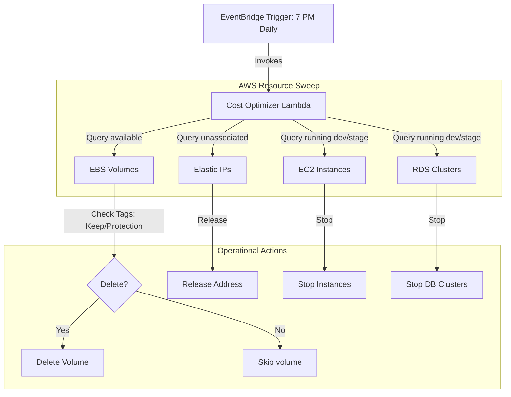

# AWS FinOps Cost Optimizer Bot

A Python-based AWS Lambda application designed to optimize AWS resource billing by pruning orphaned resources and automatically shutting down non-production environments outside working hours.

---

## 📊 Architecture & Workflows

Below is the workflow layout showing how EventBridge triggers the cost optimizer Lambda to run safety checks and delete/stop targeted resources:



---

## 💡 What We Will Learn in This Repo

By deploying this codebase, you will learn how to:
- **Interface with AWS Boto3 SDK**: Use Python to query, stop, and delete resources across EC2 and RDS APIs.
- **Implement FinOps Cost Audits**: Write automated sweeps to release unused IP addresses and delete orphaned storage volumes.
- **Enforce Safety Tag Gates**: Evaluate resource tags inside Python to exclude protected items from deletion scripts.
- **Deploy Serverless Bots**: Package Python functions with standard requirements and deploy them to AWS Lambda.
- **Configure EventBridge Crons**: Schedule automated execution runs using AWS EventBridge rule triggers.

---

## 📖 Step-by-Step Implementation Guide

Follow these steps to package and deploy the cost optimizer:

### 1. Repository Setup
Clone the codebase locally:
```bash
git clone https://github.com/Pradeeptalari14/aws-cost-optimizer.git
cd aws-cost-optimizer
```

### 2. Package Function Dependencies
Install boto3 locally to package it together with the lambda script:
```bash
# Install dependencies in current directory
pip install -r requirements.txt -t .
```

### 3. Build Deployment Archive
Compress the python scripts and dependencies into a zip file:
```bash
# Zip archive
zip -r cost-optimizer.zip .
```

### 4. Create AWS Lambda Execution Role
Create an IAM Role for your Lambda function with the following inline policy:
```json
{
  "Version": "2012-10-17",
  "Statement": [
    {
      "Effect": "Allow",
      "Action": [
        "ec2:DescribeVolumes",
        "ec2:DeleteVolume",
        "ec2:DescribeAddresses",
        "ec2:ReleaseAddress",
        "ec2:DescribeInstances",
        "ec2:StopInstances",
        "rds:DescribeDBClusters",
        "rds:StopDBCluster",
        "rds:ListTagsForResource",
        "logs:CreateLogGroup",
        "logs:CreateLogStream",
        "logs:PutLogEvents"
      ],
      "Resource": "*"
    }
  ]
}
```

### 5. Deploy Zip to AWS Lambda
Create a Lambda function named `aws-cost-optimizer` in your AWS Console (Runtime: `Python 3.10+`), upload `cost-optimizer.zip`, and assign the IAM role you created.

### 6. Attach EventBridge Cron Trigger
Create an Amazon EventBridge Rule (Cron schedule) to invoke your function daily at 7:00 PM:
- **Cron Expression**: `cron(0 19 * * ? *)`
- **Target**: Lambda Function -> `aws-cost-optimizer`

---

## 🔄 Things You Need to Replace (Customization Checklist)

To adapt the script for your operations, update these files:
- **Environment Tag filters**: In `lambda_function.py` (line 74 and 96), customize the environment labels `['dev', 'development', 'stage', 'staging', 'test']` if your development resources use other naming conventions.
- **Safety Tags**: In `lambda_function.py` (line 33), modify the tags `'keep'` and `'protection'` to match your existing resource protection tags.

---

## 🛠️ Useful Commands (Project-Specific Reference)

```bash
# Package function locally on Windows (PowerShell)
pip install -r requirements.txt -t .; Compress-Archive -Path * -DestinationPath cost-optimizer.zip -Force

# Upload function directly to AWS via CLI
aws lambda update-function-code --function-name aws-cost-optimizer --zip-file fileb://cost-optimizer.zip
```

---

## 🔗 References & Guides
- **Portfolio Website**: [talaripradeep.info](https://talaripradeep.info/)
- **DevOps Console Hub**: [talaripradeep.info/tools/](https://talaripradeep.info/tools/)
- **Live Guide**: [talaripradeep.info/tools/python/index.html](https://talaripradeep.info/tools/python/index.html)
